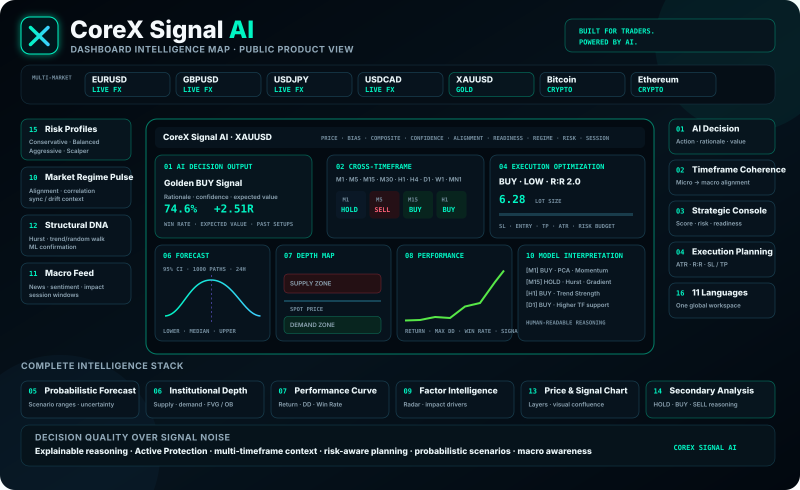
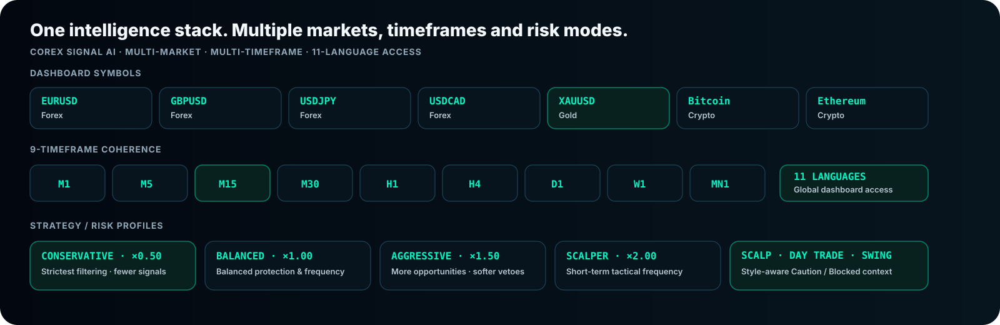

# CoreX Signal AI — Public Organization Profile & Documentation

This repository powers the public GitHub organization profile for **CoreX Signal AI** and contains the official public-facing product, dashboard, brand, security and support documentation.

> **Organization profile:** [`profile/README.md`](profile/README.md)

## Technology origin

**CoreX Signal AI is built on proprietary technology infrastructure designed and developed by CoreX Capital AI.**

CoreX Capital AI is the developer of the CoreX Signal AI core technology infrastructure. Third-party services and platforms referenced across this repository are integration, connectivity, market-data, visualization, storage or delivery components; they are not the developer or owner of the CoreX Signal AI core infrastructure.

## Visual product overview

## Documentation index

| Document | Description |
|---|---|
| [**Product Overview**](PRODUCT.md) | Official CoreX Signal AI product overview |
| [**Complete Dashboard Guide**](DASHBOARD.md) | Detailed module-by-module dashboard documentation |
| [**Feature Catalog**](FEATURES.md) | Complete public feature matrix |
| [**Markets & Timeframes**](MARKETS.md) | Multi-market coverage, 9-timeframe stack and trade styles |
| [**Risk Profiles**](RISK_PROFILES.md) | Conservative, Balanced, Aggressive and Scalper behavior |
| [**Decision States**](DECISION_STATES.md) | BUY / SELL / HOLD / VETO and Active Protection |
| [**Integrations & Infrastructure**](INTEGRATIONS.md) | Public technology and delivery architecture |
| [**Brand Guide**](BRAND.md) | CoreX Signal AI public identity and messaging rules |
| [**Security Policy**](SECURITY.md) | Responsible vulnerability reporting |
| [**Support**](SUPPORT.md) | Official product and account support channels |
| [**Contributing**](CONTRIBUTING.md) | Public documentation contribution guidelines |
| [**Code of Conduct**](CODE_OF_CONDUCT.md) | Community interaction standards |

## Official destinations

- Website: https://corexsignalai.com/
- Live Dashboard: https://api.corexsignalai.com/
- Interactive Demo: https://corexsignalai.com/demo.html
- Contact: info@corexsignalai.com

## Repository scope

This is a **public product / organization documentation repository**. Proprietary model code, production credentials, private infrastructure configuration, internal security material and user data are intentionally not published here.