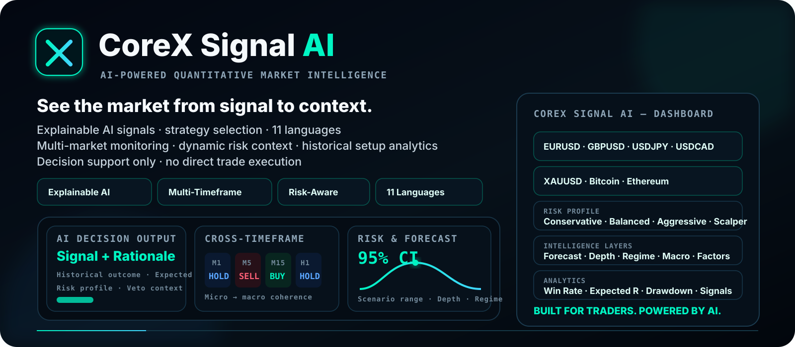
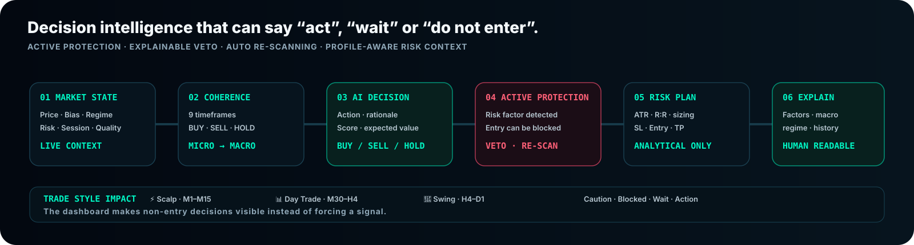
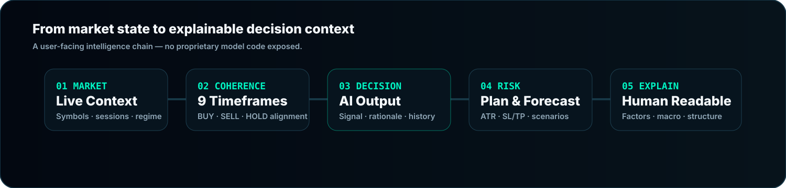

 

# CoreX Signal AI

### AI-Powered Quantitative Market Intelligence

**Explainable AI · Multi-Market Intelligence · 9-Timeframe Coherence · Dynamic Risk Context · 11-Language Access · Historical Setup Analytics**

---

## One dashboard. Multiple intelligence layers.

**CoreX Signal AI** is an AI-powered quantitative market intelligence and signal analytics platform built to transform complex multi-market data into a readable, high-speed decision workspace.

Instead of reducing the market to a single BUY / SELL badge, the product combines **AI decision logic, multi-timeframe coherence, strategy profiles, Active Protection, risk planning, probabilistic forecasting, institutional depth, historical setup analytics, model interpretation, factor intelligence, regime analysis, macro context and price / signal visualization**.

> CoreX Signal AI is designed for **analysis and decision support**. It does **not** directly execute trades.

| **7 Dashboard Symbols** | **9 Timeframes** | **4 Risk Profiles** | **3 Trade Styles** | **11 Languages** |
|:---:|:---:|:---:|:---:|:---:|
| EURUSD → Ethereum | M1 → MN1 | Conservative → Scalper | Scalp · Day · Swing | Global UX |

---

## Dashboard Intelligence Overview

The dashboard is structured as a complete intelligence stack rather than a collection of disconnected widgets.

| Intelligence layer | What the user gets |
|---|---|
| 🧠 **AI Decision Output** | BUY / SELL / HOLD / VETO, recommended action, rationale, historical Win Rate, Expected R and setup context |
| ↕ **Cross-Timeframe Coherence** | Micro-to-macro agreement across nine timeframes |
| 🎛 **Strategic Console** | AI Confidence, Master Score, Market Risk and directional-power context |
| 🛡 **Execution Optimization** | ATR-aware analytical sizing, R:R, SL / Entry / TP geometry and risk-budget context |
| 🔮 **Probabilistic Forecasting** | 95% CI, 1,000-path scenario distribution, lower / median / upper outcomes |
| 🏦 **Institutional Depth Map** | Supply / demand zones, FVG / OB context and spot-price anchoring |
| 📈 **Strategy Performance Curve** | Historical / simulated return, drawdown, Win Rate, signal count and equity curve |
| 🔍 **Model Interpretation** | Human-readable reasoning by timeframe |
| 🕸 **Factor Intelligence Hub** | Radar view and ranked positive / negative impact drivers |
| 🌐 **Market Regime Pulse** | Alignment, drift and cross-market correlation context |
| 📰 **Macro Intelligence Feed** | Headlines, sentiment, impact and session windows |
| 🧬 **Regime & Structural DNA** | Trending / Random-Walk state, Hurst and ML context |
| 📊 **Price & Signal Chart** | Price path with selectable signal layers |
| 🧭 **Secondary Timeframe Analysis** | Additional BUY / SELL / HOLD reasoning outside the primary timeframe |
| ⚙️ **Strategy Selection** | Conservative, Balanced, Aggressive and Scalper behavior |
| 🌍 **Global Experience** | 11-language access across the same intelligence workflow |

[**Read the complete dashboard guide →**](../DASHBOARD.md)

---

## Active Protection — Protection Is a First-Class Decision

A professional decision system must be able to say **do not enter**.

CoreX Signal AI treats **BUY, SELL, HOLD and VETO / Active Protection** as meaningful outcomes. When an inhibitor is active, the platform can expose:

- protection status;
- recommended action;
- inhibitor / meta-analysis context;
- profile-adjusted decision context;
- automatic re-scanning;
- separate impact across Scalp, Day Trade and Swing horizons.

This gives users visibility not only into **why a trade exists**, but also **why a trade is being blocked**.

[**Decision states & Active Protection →**](../DECISION_STATES.md)

---

## Multi-Market · Multi-Timeframe · Multi-Profile

### Dashboard symbol selection

`EURUSD` · `GBPUSD` · `USDJPY` · `USDCAD` · `XAUUSD` · `Bitcoin` · `Ethereum`

### 9-timeframe coherence stack

`M1` · `M5` · `M15` · `M30` · `H1` · `H4` · `D1` · `W1` · `MN1`

### Strategy / risk profiles

| Profile | Multiplier | Public behavior |
|---|---:|---|
| 🛡 **Conservative** | `×0.50` | Highest-conviction filtering · fewer signals · strictest veto behavior |
| ⚖️ **Balanced** | `×1.00` | Balanced protection and opportunity frequency |
| ⚡ **Aggressive** | `×1.50` | More opportunities · softer vetoes can become warnings |
| 🎯 **Scalper** | `×2.00` | Maximum short-term tactical frequency |

### Trade-style impact

**⚡ Scalp `M1–M15` · 📊 Day Trade `M30–H4` · 🌊 Swing `H4–D1`**

[Markets & timeframes](../MARKETS.md) · [Risk profiles](../RISK_PROFILES.md)

---

## Explainable AI — Signal → Reason → Risk

CoreX Signal AI is designed around **human-readable model context** rather than a black-box signal badge.

Visible reasoning can surface contributors such as:

**Trend Strength · PCA Principal Factor · Momentum Differential · Slope Gradient · Momentum Acceleration · Hurst Trend Exponent · Short-Term Flow Imbalance · Dynamic Time-Warp Match · Distribution Skew · Volatility / Regime Effects · RSI / MACD Divergence · Directional Boost / Inhibitor Context**

The user-facing chain is:

> **Market state → timeframe agreement → AI decision → protection / risk → forecast → structural context → readable reasoning**

---

## AI Decision Output

The primary decision layer is designed to answer immediately:

1. **What is the current action state?**
2. **Why is the system saying that?**
3. **What evidence and risk context surround the decision?**

Depending on conditions it can display **BUY, SELL, HOLD, VETO, Active Protection, recommended action, rationale, score / threshold, historical Win Rate, Expected R, past setups, profile context and model reasoning**.

---

## Cross-Timeframe Coherence

Every timeframe can carry its own state and context. The matrix lets users see whether short-term flow agrees with higher-timeframe structure and can summarize **Buy count, Sell count, Wait count, coherence percentage and the active profile timeframe**.

---

## Strategic Console / Master Action Gauge

Fast visual gauges summarize **AI Confidence, Master Score, Market Risk and directional power**, giving users a compact view of decision quality before they open deeper analytical layers.

---

## Execution Optimization

The analytical planning layer can expose:

`Direction · Risk Class · R:R · Lot Size · Stop Loss · Entry · Take Profit · Risk Budget · TP Distance · SL Distance · ATR % · ATR-14`

It is designed to connect signal context to disciplined planning. **It does not directly execute trades.**

---

## Probabilistic Forecast Engine

The forecasting layer presents uncertainty through **95% confidence intervals, 1,000 simulated paths, forecast horizon, lower / median / upper scenarios and directional spread** instead of presenting one deterministic future price.

---

## Institutional Depth Map

The structural view positions the current market around **Institutional Supply / Demand Zones, FVG / OB context, zone confidence and live spot-price anchoring**.

---

## Strategy Performance Curve

Historical / simulated signal-history context can be presented through **Return, Maximum Drawdown, Win Rate, Signal Count and an equity / performance curve**.

These figures are contextual analytics and do not guarantee future performance.

---

## Model Interpretation + Factor Intelligence

### Model Interpretation Layer
Human-readable per-timeframe reasoning shows which factors support, oppose or neutralize the active state.

### Factor Intelligence Hub
A factor radar and ranked **Impact Drivers** surface positive and negative analytical contributors.

---

## Market Regime + Structural DNA

### Market Regime Pulse
**Alignment · drift · correlation · reference timeframe · market-sync context**

### Regime & Structural DNA
**Trending / Random-Walk · Hurst · structural score · ML confirmation / neutral state**

---

## Macro Intelligence Feed

The dashboard can keep **headline context, sentiment state, impact level and upcoming market-session windows** inside the same decision workspace.

---

## Price & Signal Chart + Secondary Timeframe Analysis

The chart provides multi-timeframe price visualization with selectable signal overlays. Secondary analysis cards explain non-primary timeframe states, including why a market remains HOLD, where an inhibitor exists and which factors created directional or reversal context.

> **Decision quality is more important than forcing signal frequency.**

---

## Public Technology & Delivery Ecosystem

The public product presentation references a wider ecosystem across market connectivity, data, visualization, storage and delivery:

**CoreX Capital AI · Axis Option · MetaTrader 5 · Bloomberg · Refinitiv · FactSet · S&P Global · ICE · TradingView · Binance · Cloudflare · PostgreSQL · Redis · MongoDB**

Brand names identify public technology / infrastructure references; no endorsement is implied unless explicitly stated by the respective brand owner.

[**View integrations & public architecture →**](../INTEGRATIONS.md)

---

## Complete Public Documentation

| Document | Purpose |
|---|---|
| 📘 [**Dashboard Guide**](../DASHBOARD.md) | Full module-by-module dashboard documentation |
| ✨ [**Feature Catalog**](../FEATURES.md) | Complete public feature matrix |
| 🌍 [**Markets & Timeframes**](../MARKETS.md) | Symbols, timeframe stack and trade-style mapping |
| 🛡 [**Risk Profiles**](../RISK_PROFILES.md) | Conservative, Balanced, Aggressive and Scalper behavior |
| 🚦 [**Decision States**](../DECISION_STATES.md) | BUY / SELL / HOLD / VETO and Active Protection |
| 🏗 [**Integrations**](../INTEGRATIONS.md) | Public technology and delivery architecture |
| 🎨 [**Brand Guide**](../BRAND.md) | Public identity and messaging rules |
| 🔐 [**Security Policy**](../SECURITY.md) | Responsible vulnerability reporting |
| 💬 [**Support**](../SUPPORT.md) | Product and account support channels |

---

## Built for traders. Powered by AI.

### [Explore CoreX Signal AI →](https://corexsignalai.com/) · [Open the Demo →](https://corexsignalai.com/demo.html) · [Launch Dashboard →](https://api.corexsignalai.com/)

**AI-powered. Data-driven. Human-understandable.**

Risk & Information Notice: CoreX Signal AI provides analytical and informational market intelligence. It does not guarantee trading outcomes and does not directly execute trades. Historical, simulated or illustrative metrics — including Win Rate, Expected R, returns, drawdown, confidence and signal count — do not guarantee future performance. Financial markets involve risk, including the possible loss of capital. Users are responsible for their own decisions and for compliance with applicable local requirements.

